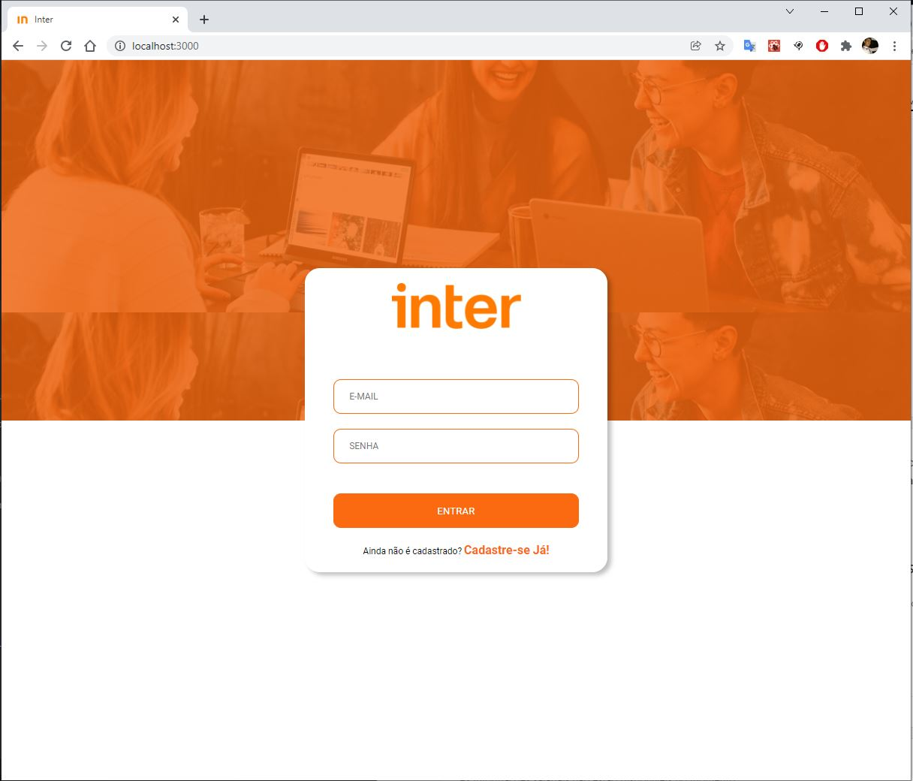
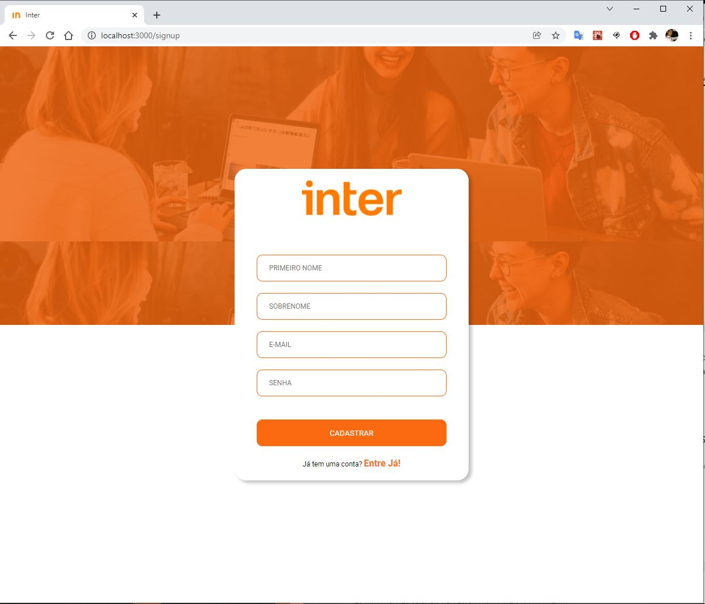
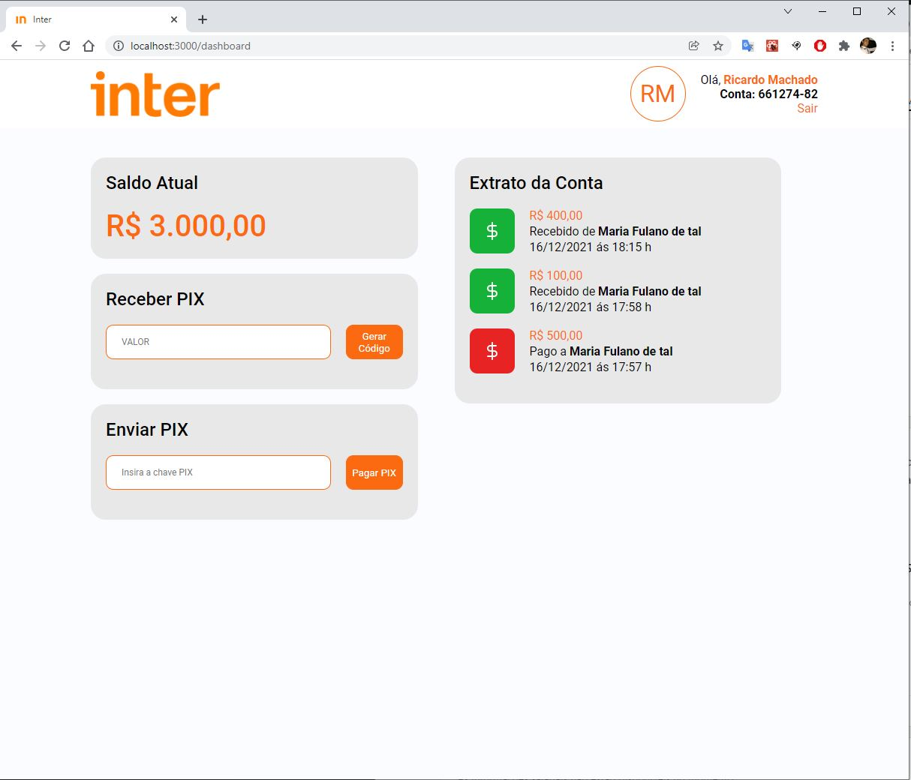

<h1 align='center'>
  
</h1>

  

  <a href="#Sobre">Sobre</a>&nbsp;&nbsp;&nbsp;|&nbsp;&nbsp;&nbsp;
  <a href="#Banco-de-Dados">Banco-de-Dados</a>&nbsp;&nbsp;&nbsp;|&nbsp;&nbsp;&nbsp;
  <a href="#Tecnologias">Tecnologias</a>&nbsp;&nbsp;&nbsp;|&nbsp;&nbsp;&nbsp;
  <a href="#Observações">Observações</a>

<h1 align='center'>
  
  
  
</h1>

## Sobre

O projeto teve como finalidade o desenvolvimento de uma aplicação Full Stack JS em parceria com a plataforma DIO, Órbi Conecta e Banco Inter. Com a aplicação é possível realizar o cadastro de usuários, efetuar o login e fazer transações de valores utilizando a chave PIX gerada pela API.

Sua interface visual foi desenvolvida utilizando React e Styled-Components.

## Banco-de-Dados

Para esse projeto foi utilizado o banco de dados Postgres, no qual realizamos a sua conexão via Docker.

Atenção para o arquivo ormconfig.json que deve ser criado no back-end e configurado de acordo com as informações de criação do Docker, evitando assim erro de conexão. 

 No terminal do Docker 

<pre>
  <code>
    docker run --name default -d -p 5432:5432 -e POSTGRES_USER=postgres -e POSTGRES_PASSWORD=9707 -e POSTGRES_DB=inter postgres
  </code>
</pre>

  Documentação de Apoio em: <a href="https://hub.docker.com/">Docker Hub</a 

## Para executar o projeto
<li>Clonar todo o repositório</li>
<li>Com o banco de dados ativo:
  <ul>
    <li>Back-enk: entrer na pasta Inter-Back-end e rodar o comando:</>
      <code>
         yarn start
      </code>
    </li>
    <li>Front-enk: entrer na pasta Inter-Front-end e rodar o comando:</>
      <code>
        yarn start
      </code>
    </li>
   </ul>
</li>

## Tecnologias

  As seguintes ferramentas foram utilizadas na construção do projeto: 

<li>React.js</li>
<li>Node.js</li>
<li>Styled-Components</li>
<li>Express</li>
<li>Axios</li>
<li>TypeScript</li>
<li>TypeOrm</li>
<li>JWT - JsonWebToken</li>
<li>Docker</li>
